<div align="center">

# 🤖 ScreenerBot

### The First Native Local Trading System for Solana DeFi

[](https://solana.com)
[](https://www.rust-lang.org)
[](https://github.com/screenerbot/Public)
[](https://github.com/screenerbot/Public)

**State-of-the-art automated trading engine built in Rust for maximum speed and precision**

*Same language as Solana • Direct pool pricing • Multi-source intelligence • Full self-custody*

[🚀 Get Started](https://screenerbot.io) • [📖 Documentation](https://screenerbot.io/docs) • [💬 Community](https://screenerbot.io/community) • [🌐 Website](https://screenerbot.io)

</div>

---

## 🎯 Why ScreenerBot?

**The Problem:**

Most Solana trading tools rely on delayed API data, run on shared cloud infrastructure, and force you to trust third-party platforms with your assets. For professional traders, these limitations cost real money every day.

**The Solution:**

ScreenerBot is a **local application** that runs on **your hardware**, calculates prices **directly from blockchain data**, and executes trades **through your wallet**—no platforms, no custody, no delays.

### Built for Performance

- 🦀 **Written in Rust** — Same systems language as Solana itself
- ⚡ **Native Runtime** — Compiled to machine code like C/C++ for maximum speed
- 🔗 **Official Solana SDK** — Direct integration with blockchain libraries
- 💻 **Local Execution** — Your hardware, your speed, your control

### Built for Accuracy

- 📊 **Direct Pool Calculation** — 3-100% more accurate than aggregators
- 🔄 **Real-Time Pricing** — Calculate from pool reserves in <50ms
- 📡 **Multi-Source Validation** — DexScreener + GeckoTerminal + RugCheck + On-chain
- 🎯 **Zero Aggregator Lag** — See actual tradeable prices, not stale data

### Built for Security

- 🔐 **Self-Custody** — Private keys never leave your machine
- 🛡️ **Pre-Trade Validation** — Automatic security checks before every entry
- 🚫 **Auto-Blacklisting** — Detect and avoid problematic tokens
- ✅ **RugCheck Integration** — Real-time security analysis

---

## 📸 Screenshots

### Position Management
Track every trade with precision - real-time P&L, DCA rounds, and complete history.

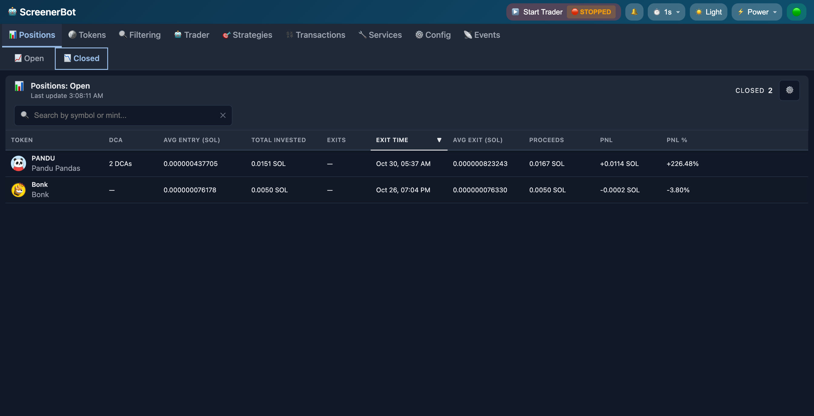

### Token Filtering
Advanced multi-criteria filtering with security analysis and multi-source validation.

<table>
<tr>
<td>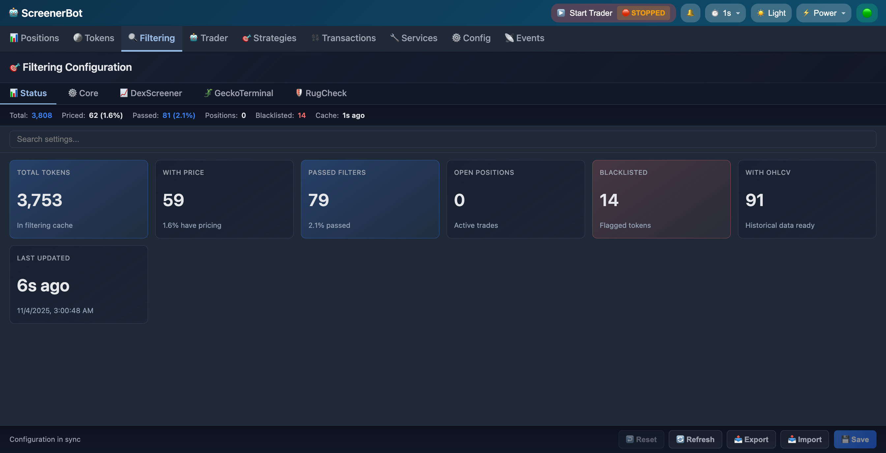</td>
<td>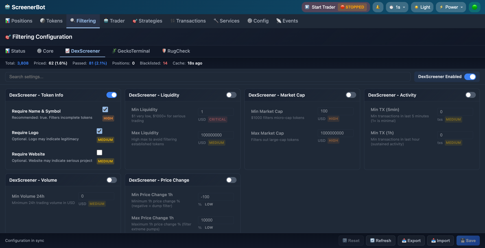</td>
</tr>
<tr>
<td>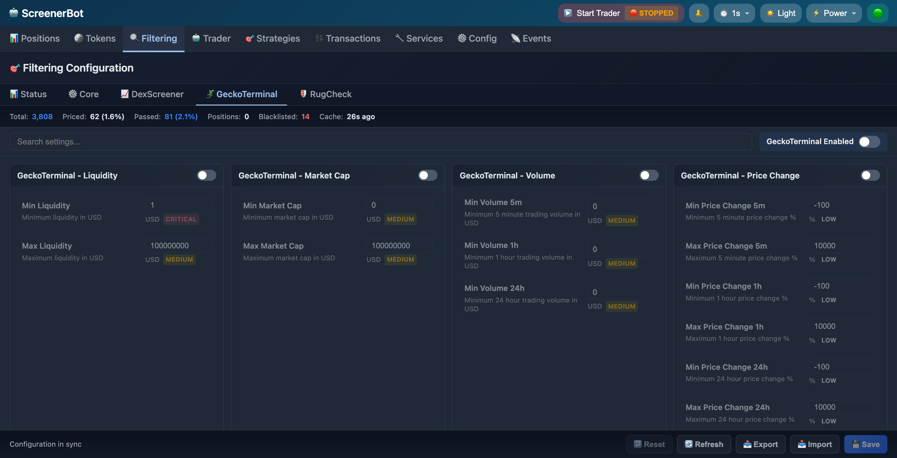</td>
<td>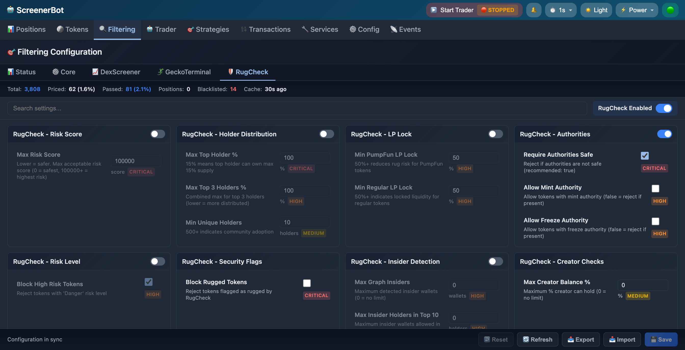</td>
</tr>
</table>

### Transaction Monitor
Real-time transaction stream with automatic DEX classification and P&L tracking.

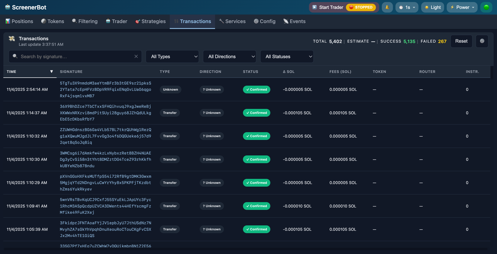

### Trading Control
Start/stop trading, configure strategies, and monitor active positions.

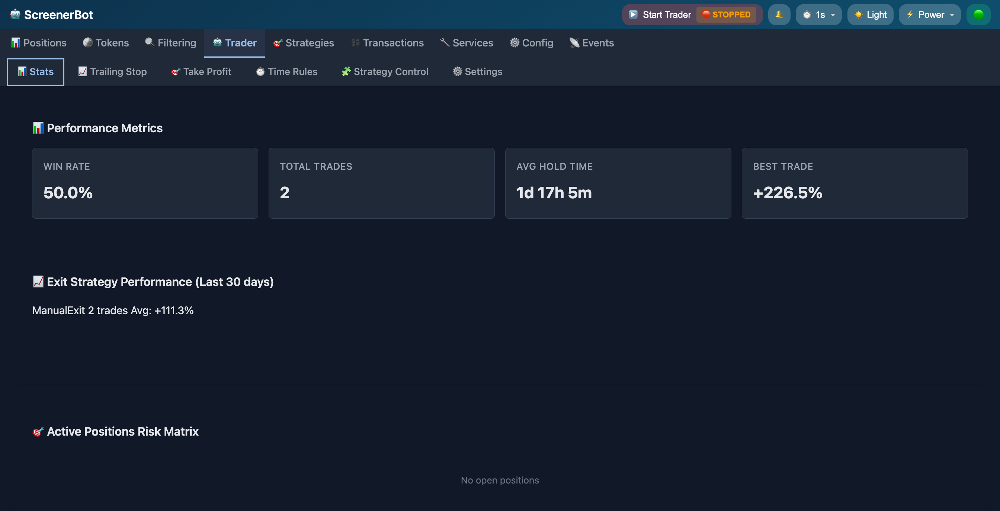

### Token Database
Comprehensive token intelligence with market data and pool information.

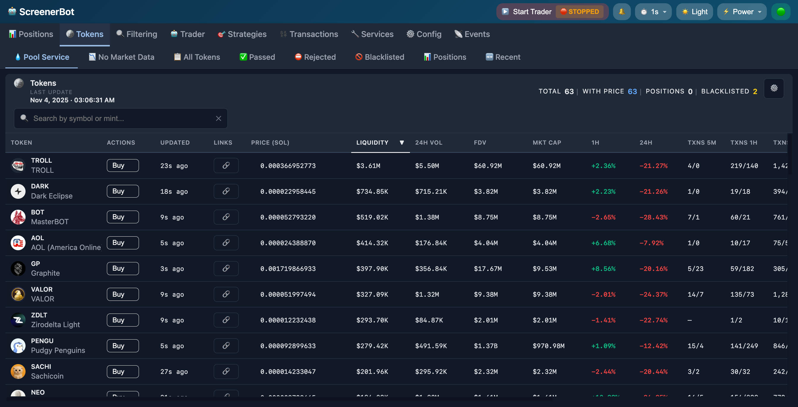

### Strategy Engine
Build custom trading strategies with condition-based logic.

<table>
<tr>
<td>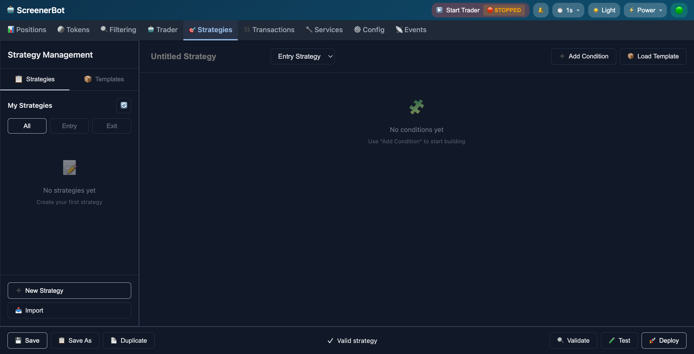</td>
<td>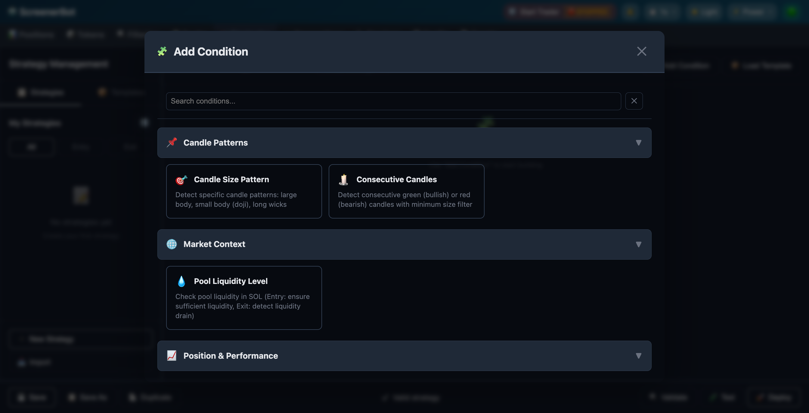</td>
</tr>
</table>

### Configuration Panel
Fine-tune every parameter with hot-reload support.

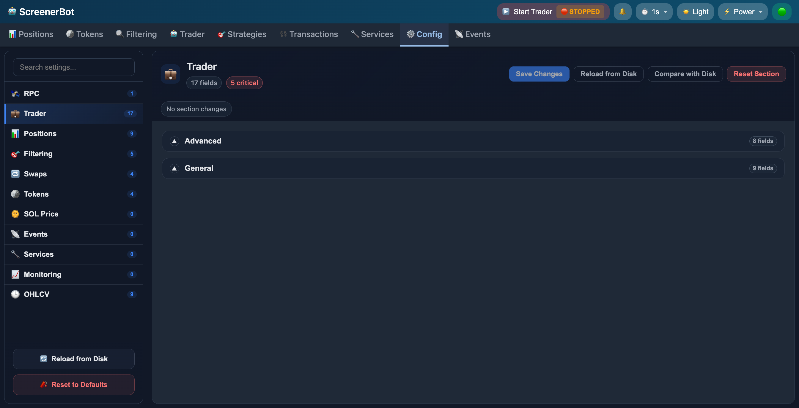

---

## 🏗️ Technical Architecture

### Local-First Design

ScreenerBot runs **entirely on your machine** and communicates **directly with the Solana blockchain**. No platform intermediaries, no shared infrastructure, no custody risk.

```
┌─────────────────────────────────────┐
│   Your Computer (ScreenerBot)       │
│                                      │
│  ┌──────────────────────────────┐  │
│  │  Rust Engine                  │  │
│  │  - Pool decoders (12+ DEXs)   │  │
│  │  - Price calculator           │  │
│  │  - Strategy evaluator         │  │
│  │  - Transaction builder        │  │
│  └──────────────────────────────┘  │
│               ↓                     │
│  ┌──────────────────────────────┐  │
│  │  Your Wallet (Self-Custody)   │  │
│  │  - Private keys (local only)  │  │
│  │  - Transaction signing        │  │
│  └──────────────────────────────┘  │
└─────────────────────────────────────┘
                ↓
    ┌───────────────────────┐
    │   Solana RPC Node      │
    │   (Blockchain Access)  │
    └───────────────────────┘
                ↓
    ┌───────────────────────┐
    │   DEX Smart Contracts  │
    │   - Raydium            │
    │   - Orca               │
    │   - Meteora            │
    │   - Pumpfun            │
    │   - 8+ more            │
    └───────────────────────┘
```

### Data Flow

**Price Calculation:**
1. Fetch pool account data from Solana RPC (100-200ms)
2. Decode reserves using DEX-specific layouts (1-5ms)
3. Calculate spot price from reserve ratios (1-2ms)
4. Background refresh every 0.5 seconds
5. **Total: <250ms from request to result**

**Trade Execution:**
1. Strategy signals entry/exit condition
2. Query Jupiter + GMGN + Direct pools for best route (<500ms)
3. Build transaction locally with optimal parameters
4. Sign with local wallet
5. Submit directly to Solana RPC
6. **Total: <1 second from signal to blockchain**

### Performance Characteristics

| Operation | ScreenerBot | Typical Cloud Bot |
|-----------|-------------|-------------------|
| Price calculation | 5-50ms | 500-2000ms |
| Multi-pool query (50 pools) | 200-400ms | 2000-5000ms |
| Strategy evaluation | <10ms | 50-200ms |
| Trade decision → execution | <100ms | 500-1500ms |
| Database query (position lookup) | <1ms (local SSD) | 10-50ms (network) |

*Benchmarks measured on M1 MacBook Pro with premium RPC endpoint*

---

## ✨ Features

## ✨ Core Features

### 🎯 Direct Pool Pricing

**The Accuracy Advantage**

Traditional price aggregators (DexScreener, CoinGecko, etc.) introduce 30-60 second delays due to:
- Polling intervals (to reduce API costs)
- Processing and caching layers
- Serving thousands of concurrent users

**ScreenerBot calculates prices directly from blockchain data:**

- Fetches pool account state from Solana RPC every 0.5 seconds
- Decodes reserves using official DEX program layouts
- Calculates spot price using reserve ratios
- Active positions refreshed every 5 seconds

**Result: 3-100% more accurate pricing** compared to aggregators, especially for low-cap and volatile tokens.

---

### 🔄 Multi-Source Intelligence

**All Data, One Platform**

| Source | Data Type | Update Frequency |
|--------|-----------|------------------|
| 🔗 **Solana Blockchain** | Pool reserves, liquidity, on-chain pricing | Every 0.5s (positions: 5s) |
| 🔍 **DexScreener** | Market data, volume, trending tokens | Priority-based |
| 🦎 **GeckoTerminal** | Pool information, token discovery | Priority-based |
| 🛡️ **RugCheck** | Security scores, authority checks | On-demand |
| 🪐 **Jupiter** | Swap routing, execution prices | Per-trade |
| 💧 **GMGN** | Alternative routing | Per-trade |

**Filter tokens across all sources simultaneously:**
- Set criteria once (liquidity, volume, security, age)
- ScreenerBot validates against all sources in parallel
- Get passed/rejected lists with detailed reasons
- Monitor hundreds of tokens 24/7 automatically

---

### 🎲 Strategy Engine

**Advanced Entry & Exit Logic**

**Entry Strategies:**
- Price conditions (breakouts, support/resistance)
- Volume conditions (unusual spikes, sustained trends)
- Liquidity conditions (minimum thresholds, growth rate)
- Security conditions (RugCheck scores, authority checks)
- Time conditions (age requirements, time-of-day filters)

**Exit Strategies:**

**1. Trailing Stop Loss** *(Protect Profits Dynamically)*
```
Entry: 0.0001 SOL
Price → 0.00015 SOL (+50%)
Trailing stop activates at +10% → Stop moves to 0.0001425 SOL (5% below peak)
Price drops to 0.0001425 SOL → Auto-exit, locking in +42.5% profit
```

**2. ROI-Based Take Profit** *(Fixed Targets)*
```
Entry: 0.0002 SOL
Target: +25%
Exit: 0.00025 SOL → Auto-exit when target reached
```

**3. Time-Based Override** *(Capital Efficiency)*
```
Entry: Token shows promise but consolidates
Max hold: 24 hours
After 24 hours → Auto-exit regardless of P&L, free capital for new trades
```

**DCA Support:**
- Add to positions at configured profit thresholds (+10%, +20%, +30%)
- Automatic cost basis tracking across multiple entries
- Partial exit support for taking profits incrementally

---

### 💼 Position Management
**Track every trade with precision**

- ✅ Real-time profit/loss calculations
- ✅ DCA and partial exit tracking
- ✅ Complete entry/exit history
- ✅ Export to CSV for analysis
- ✅ Multi-entry position support
- ✅ Automatic cost basis calculation

### 🔍 Token Filtering
**Find quality tokens automatically**

- ✅ Multi-source data validation (DexScreener, GeckoTerminal, RugCheck)
- ✅ Security risk analysis and scoring
- ✅ Custom filtering rules for liquidity, volume, age
- ✅ Pass/reject tracking with detailed reasons
- ✅ Real-time monitoring of filtered tokens
- ✅ Blacklist management

### 📝 Transaction Monitor
**See every wallet activity instantly**

- ✅ Live transaction streaming via WebSocket
- ✅ Automatic DEX classification (12+ DEXs)
- ✅ P&L tracking per transaction
- ✅ Complete audit trail with timestamps
- ✅ Swap detection and analysis
- ✅ Historical transaction lookup

### 🤖 Trading Control
**Automated trading with full control**

- ✅ One-click start/stop control
- ✅ Strategy configuration and management
- ✅ Risk parameter tuning
- ✅ Active monitoring list
- ✅ Priority-based execution
- ✅ Safety checks and validation

### 💰 Wallet Analytics
**Know your holdings instantly**

- ✅ Real-time balance updates
- ✅ Historical snapshots
- ✅ Token holdings breakdown
- ✅ CSV export for accounting
- ✅ Automatic ATA cleanup
- ✅ Balance change tracking

### 🪙 Token Database
**Comprehensive token intelligence**

- ✅ Multi-source market data aggregation
- ✅ Security risk scores from RugCheck
- ✅ Pool liquidity tracking (12+ DEXs)
- ✅ Blacklist management
- ✅ Token discovery and monitoring
- ✅ Decimal precision handling

### 🎯 Strategy Engine
**Build and test your trading logic**

- ✅ Visual strategy builder
- ✅ Multiple condition types (price, volume, indicators)
- ✅ Entry and exit signal evaluation
- ✅ Strategy activation control
- ✅ Performance tracking
- ✅ Database persistence

### ⚙️ Configuration Panel
**Fine-tune every parameter**

- ✅ Hot-reload configuration (no restart needed)
- ✅ Visual parameter editing
- ✅ Export/import settings
- ✅ Validation and safety checks
- ✅ Metadata-driven UI
- ✅ TOML-based configuration

---

## 🛡️ Security Architecture

**Pre-Trade Safety Checks (Automatic):**
- ✅ Freeze authority verification (must be renounced)
- ✅ Mint authority verification (must be renounced)
- ✅ Holder distribution analysis (not concentrated)
- ✅ Liquidity lock validation (locked or burned)
- ✅ RugCheck score validation (must meet threshold)

**If any check fails → Trade is blocked automatically**

**Runtime Protection:**
- Automatic blacklisting after large losses
- Failed transaction pattern detection
- Liquidity withdrawal monitoring
- Smart retry with compute unit adjustment

---

## ⚡ Multi-DEX & Multi-Router Support

**Supported DEXs (12+):**
- 🌊 Raydium (CLMM, CPMM, Legacy)
- 🐋 Orca (Whirlpool)
- ⛰️ Meteora (DAMM, DLMM, DBC)
- 🚀 Pumpfun (AMM, Legacy)
- ⚡ Fluxbeam, 🌙 Moonit, and more

**Smart Routing:**

For every trade, ScreenerBot queries:
1. **Jupiter V6** — Multi-hop routing, optimal paths
2. **GMGN** — Alternative routes for low-cap tokens
3. **Direct Pool Swaps** — Single-hop, lowest fees

**Automatically selects the router with:**
- Best execution price
- Lowest slippage
- Highest success probability

**No middleman fees:**
- Traditional platforms: 0.5-1% per trade
- Jupiter: ~0.2% routing fee
- Direct pool swap: **Only DEX protocol fee (~0.25%)**

---

## 💰 On-Chain Pricing & Pool Support

### 🔗 Direct Blockchain Integration

- ✅ Real-time price calculation from Solana chain data
- ✅ Multi-DEX pool monitoring and liquidity tracking
- ✅ Intelligent routing for best execution prices
- ✅ Support for 12+ DEX protocols
- ✅ Automatic pool discovery
- ✅ Prices updated every 0.5 seconds

### Supported DEXs

- 🌊 **Raydium** — CLMM, CPMM, Legacy pools
- 🐋 **Orca** — Whirlpool concentrated liquidity
- ⛰️ **Meteora** — DAMM, DLMM, DBC pools
- 🚀 **Pumpfun** — AMM and Legacy pools
- ⚡ **Fluxbeam** — Advanced AMM
- 🌙 **Moonit** — Community pools

---

## 📈 Market Data Integration

**Multi-Source Intelligence:**

| Source | Data Type | Use Case |
|--------|-----------|----------|
| 🔍 **DexScreener** | Token pairs, volume, prices | Real-time market tracking |
| 🦎 **GeckoTerminal** | Market data, trending tokens | Discovery & validation |
| 🛡️ **RugCheck** | Security analysis, risk scores | Token safety screening |
| 🪐 **Jupiter** | Price quotes, swap routing | Trade execution |

- 🔄 Automated data aggregation with rate limiting
- ⚡ Priority-based update scheduling
- 🎯 Multi-source cross-validation
- 📊 OHLCV data collection
- 🔍 Token discovery from multiple sources

---

## 🎯 Trading Strategies

**Automated Entry & Exit:**

```
🎲 Strategy Engine
  ├─ 📊 Condition-based entry signals
  ├─ 🎚️ Trailing stop-loss (dynamic)
  ├─ 💎 ROI-based exit targets
  ├─ ⏱️ Time-based overrides
  └─ 🔄 DCA support

💼 Position Management
  ├─ 📉 Partial exits
  ├─ 📈 Multi-entry DCA
  ├─ 🎯 Manual order placement
  └─ 📋 Order tracking & history
```

- ✅ Configurable risk parameters
- ✅ Priority-based execution
- ✅ Automatic retry logic
- ✅ Safety checks & validation
- ✅ Decision caching to prevent duplicates
- ✅ Loss detection and blacklisting

---

## 🎛️ Dashboard & API

**Control Center:**

| Feature | Description |
|---------|-------------|
| 📱 **Web Dashboard** | Real-time monitoring & configuration interface |
| 🔌 **REST API** | Full data access via HTTP endpoints |
| 📊 **Metrics Display** | Live performance & health monitoring |
| ⚙️ **Configuration UI** | Dynamic strategy & parameter tuning |
| 📋 **Position Manager** | Track & manage open/closed positions |
| 📝 **Event Logs** | Comprehensive activity & error tracking |
| 💊 **Health Checks** | Service status & connectivity monitoring |
| 🔍 **Token Search** | Search and analyze any token |
| 📈 **OHLCV Charts** | Historical price data visualization |

---

## 👥 Who Should Use ScreenerBot?

### 🎯 Professional Traders
**You need institutional-grade tools without institutional costs.**

- Direct blockchain access with RPC-level control
- Fully customizable strategy engine with multi-condition logic
- Real-time data from all major sources without subscription fees
- Self-custody security for large positions

### 📊 Active DeFi Participants
**You need automation to keep up with fast-moving markets.**

- Automated monitoring of hundreds of tokens simultaneously
- Fast reaction to opportunities (sub-second execution)
- Protection from scams with automatic security checks
- Time savings: 10-minute setup replaces hours of manual research

### 💻 Technical Users & Developers
**You need access to raw data and integration capabilities.**

- Direct pool data access with custom decoders
- Full REST API for external integrations
- Comprehensive event logging and metrics
- SQLite databases for custom analysis

---

## 🏗️ Architecture

**Built for Performance & Reliability:**

```
🦀 Rust Foundation
  ├─ 🔧 Modular service architecture
  ├─ 💾 SQLite persistence layer
  ├─ 🌐 WebSocket + RPC connectivity
  ├─ ⚙️ Configurable risk engine
  └─ 🔄 Background service management
```

### Key Design Principles

- 🎯 **Single source of truth** for configuration
- 📊 **Event-driven architecture** with structured logging
- 🔒 **Type-safe data handling** with Rust's type system
- ⚡ **Concurrent processing** with tokio async runtime
- 📈 **Observable & debuggable** with comprehensive metrics
- 🔄 **Hot-reloadable** configuration without restarts
- 💾 **Persistent storage** with SQLite databases

### System Components

| Component | Purpose |
|-----------|---------|
| **Config** | Macro-driven configuration with hot-reload |
| **Pools** | Multi-DEX pool discovery and pricing |
| **Tokens** | Unified token database with priority updates |
| **Filtering** | Multi-criteria token screening engine |
| **Swaps** | Jupiter integration for trade execution |
| **Wallet** | Balance monitoring with historical snapshots |
| **Transactions** | Real-time monitoring via WebSocket + RPC |
| **Trader** | Automated and manual trading orchestration |
| **Positions** | Position management with DCA support |
| **Strategies** | Condition-based strategy evaluation |
| **OHLCV** | Multi-timeframe price data collection |
| **Events** | Structured event logging to SQLite |
| **APIs** | Centralized API clients with rate limiting |
| **Services** | Service lifecycle management with dependencies |
| **Webserver** | Axum-based REST API + dashboard |

---

## 🎮 Use Cases

### 🤖 Automated Trading
- 24/7 market monitoring
- Strategy execution with risk management
- Multi-position management
- Automatic entry and exit

### 📊 Portfolio Management
- Real-time position tracking
- P&L analysis and reporting
- Balance monitoring and history
- Transaction audit trail

### 🔍 Market Intelligence
- Token discovery from multiple sources
- Security analysis and risk scoring
- Pool liquidity tracking
- Price monitoring and alerts

### 📈 Strategy Development
- Custom strategy creation
- Condition-based logic
- Backtesting with historical data
- Performance tracking

---

## 🚀 Performance Features

- ⚡ **Direct RPC Calls** — No unnecessary API middlemen
- 🔄 **Connection Pooling** — Efficient database access
- 📊 **Batch Processing** — Optimized RPC usage (50 accounts/call)
- 💾 **Smart Caching** — Minimize redundant operations
- 🌐 **WebSocket Streaming** — Real-time transaction monitoring
- ⏱️ **Rate Limiting** — Built-in protection for all APIs
- 🔀 **Concurrent Processing** — Tokio async runtime
- 📈 **Service Metrics** — Performance tracking with tokio-metrics

---

## 🔒 Security Features

- 🛡️ **RugCheck Integration** — Token security analysis
- 🚫 **Blacklist System** — Automatic bad token filtering
- ⚠️ **Loss Detection** — Automatic position monitoring
- ✅ **Safety Checks** — Pre-trade validation
- 🔐 **Local Wallet** — Keys never leave your machine
- 📝 **Audit Trail** — Complete transaction history
- 🔍 **Multi-Source Validation** — Cross-reference data
- 💊 **Health Monitoring** — Service and endpoint checks

---

## 📊 Data Sources

**Primary Sources:**
- 🔗 **Solana Blockchain** — On-chain pricing and pool data
- 🔍 **DexScreener** — Market data and trending tokens
- 🦎 **GeckoTerminal** — Token discovery and validation
- 🛡️ **RugCheck** — Security analysis and risk scores
- 🪐 **Jupiter** — Price quotes and swap routing
- 📊 **On-Chain RPC** — Direct Solana node access

**Data Freshness:**
- Pool prices updated every 0.5 seconds
- Active position prices updated every 5 seconds
- Token data updated based on priority
- Real-time transaction streaming
- WebSocket for instant notifications
- OHLCV data collected continuously

---

## 📚 Technology Stack

- **Language:** Rust (stable)
- **Runtime:** Tokio (async)
- **Database:** SQLite (multiple DBs)
- **Web Framework:** Axum
- **Blockchain:** Solana Web3
- **Frontend:** Embedded HTML/CSS/JS (ES modules)
- **APIs:** DexScreener, GeckoTerminal, RugCheck, Jupiter
- **Logging:** Custom structured logger with file rotation

---

## 📊 Status

> 🚧 **Active Development** — ScreenerBot is continuously evolving with new features and improvements.

This repository contains public documentation and resources only.

---

## 🔒 Private Project

The bot is a private project. Source code is not publicly available.

For more information, visit the official website.

---

Built with ❤️ for the Solana DeFi community

[](https://github.com/screenerbot/Public)
